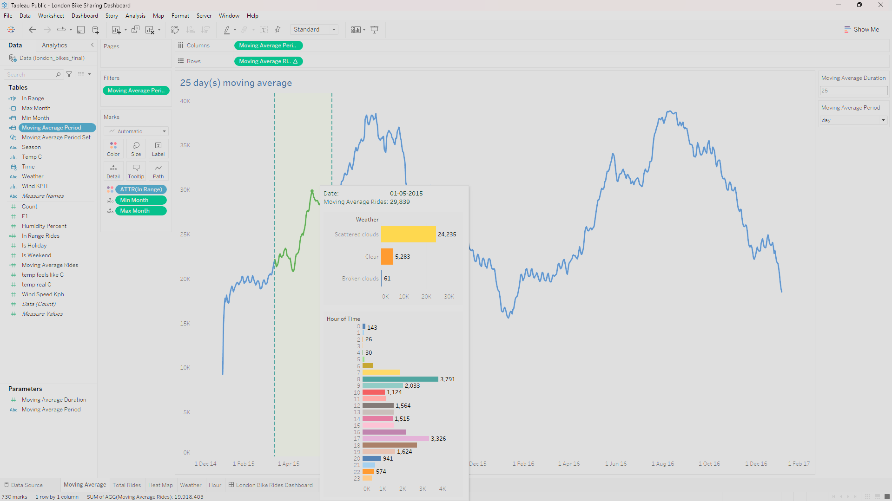
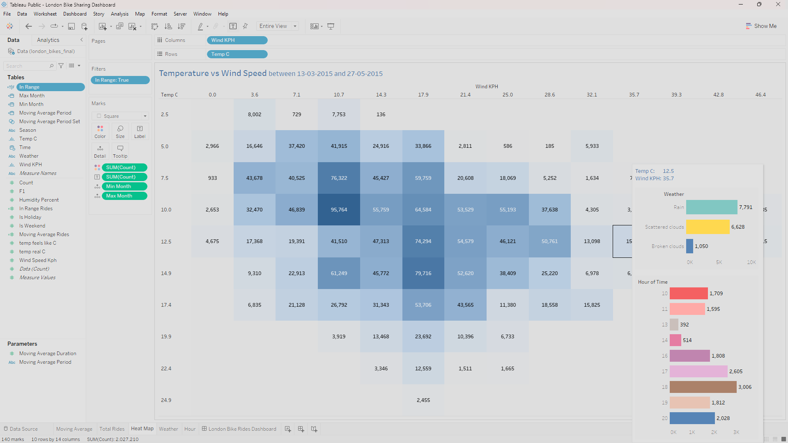

# London Bike Sharing - Project

### Tools used: Tableau, Python, Jupyter Notebook

Interact with the final dashboard here: [Tableau Public dashboard](https://public.tableau.com/views/LondonBikeSharingDashboard_17076682500710/LondonBikeRidesDashboard?:language=en-US&:display_count=n&:origin=viz_share_link)

### Project workflow:

- Import and download dataset from kaggle
  
   ```python
    !kaggle datasets download -d hmavrodiev/london-bike-sharing-dataset
   
- Extract the file using the zipfile libraries
  
   ```python
    zipfile_name = 'london-bike-sharing-dataset.zip'
    with zipfile.ZipFile(zipfile_name, 'r') as file:
        file.extractall()

- Read the downloaded .csv file and perform Data Manipulation
  
  ```python
    bikes = pd.read_csv("london_merged.csv")

- Then save the dataset as .xlsx file
  
  ```python
    bikes.to_excel('london_bikes_final.xlsx', sheet_name='Data')

- Next we will create Dashboard in Tableau.
The most important visualization created is the 'Moving Average' visualization with Reference band showcasing graphs in tooltip providing information on the number of rides in different weathers and different hours of time. I have also added a special feature where we can select a range of values and it will filter the other visualization with respect to the selection and the selection itself will be highlighted.
  - To make this visualization, I created a two parameters named 'Moving Average Period' & 'Moving Average Rides' and made a line chart with them.
  

Also, I created a heatmap for 'Temperature vs Wind Speed' visualization which is filtered by the selection in 'Moving Average' visualization. It also contain the same tootltip as in 'Moving Average'.
  
